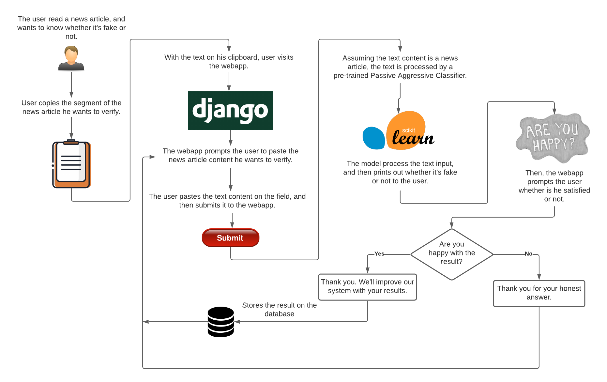

    <strong>A webapp for predicting whether the text of a news article is true or fake.</strong>

    

---

## Motivation

Fake news is a problem that emerged since the beginning of the modern information age. It spreads like a virus across the big network, and provides nothing but disinformation for the people.

Even if there are companies with a large budget investing on this field, this is a personal approach for fighting this problem, since I was not able to found a useful tool for the people that read news.

## How it works?

This is a Machine Learning oriented project. The following flowchart shows the expected use the webapp has as of now.

    

## Action items

- [x] Create correct prompts, and store results on the database if the user is satisifed.
- [ ] Write unit tests.
- [ ] Train model with mexican news (true and fake)
- [ ] Make a decent front-end
- [ ] Launch on Heroku

## Running locally

This projects runs on Python 3.7.10 version.

If you manage Anaconda/Miniconda environments on your local system, you can build the project environment with:

`conda env create -f environment.yml`

If you don't use Anaconda and you rather using another environment wrapper, install the project dependencies with:

`pip install -r requirements.txt`

Then, run the server locally

`python manage.py runserver`